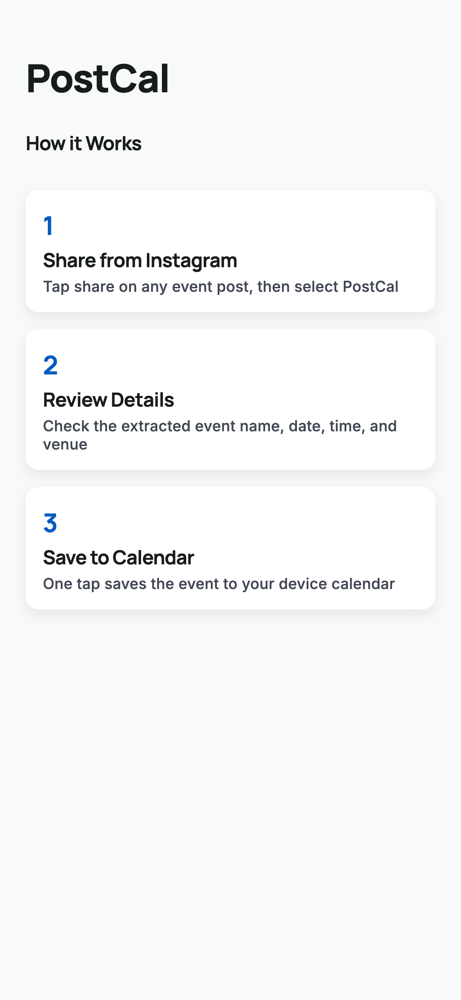

# PostCal

Share an event from Instagram, get it on your calendar in one tap.

PostCal extracts event details (name, date, time, venue) from shared social media posts using OCR and text parsing, lets you review and edit the details, then saves directly to your device calendar.



## How it works

1. **Share** — Tap "Share" on an Instagram event post and select PostCal
2. **Review** — The app extracts event details automatically; edit anything it got wrong
3. **Save** — One tap to add the event to your calendar

## Tech stack

- **Expo 54** with Expo Router (file-based routing)
- **React Native 0.81** / React 19
- **expo-share-intent** — captures shared content from other apps
- **expo-text-extractor** — OCR for extracting text from images
- **chrono-node** — natural language date/time parsing
- **expo-calendar** — writes events to the device calendar
- **React Native UI Lib** — UI components
- **TypeScript**

## Getting started

```bash
npm install
npx expo start
```

For device builds:

```bash
npx eas build --profile development
```

## Project structure

```
app/
  index.tsx        — Home/onboarding screen
  review.tsx       — Event review & editing
  success.tsx      — Save confirmation
  +native-intent   — Share intent handler
contexts/
  ExtractionContext — Shared state (content, extraction, edits, status)
lib/
  pipeline.ts      — Extraction orchestration (OCR → parse → build fields)
  parse-*.ts       — Event name, date/time, venue parsers
  calendar.ts      — Calendar permission & write helpers
```

## Platform support

- **iOS** 16.0+
- **Android** SDK 24+
