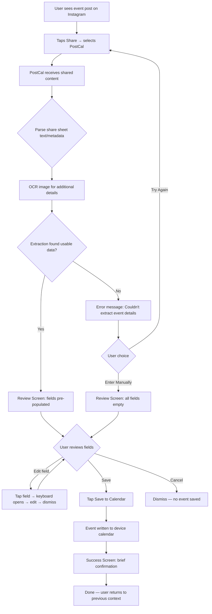
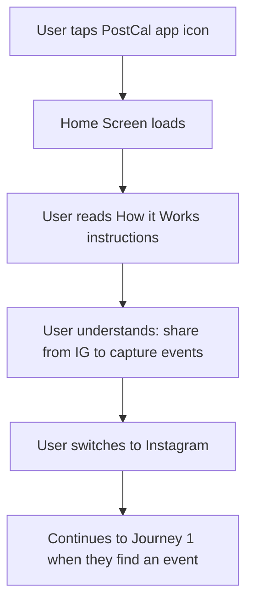
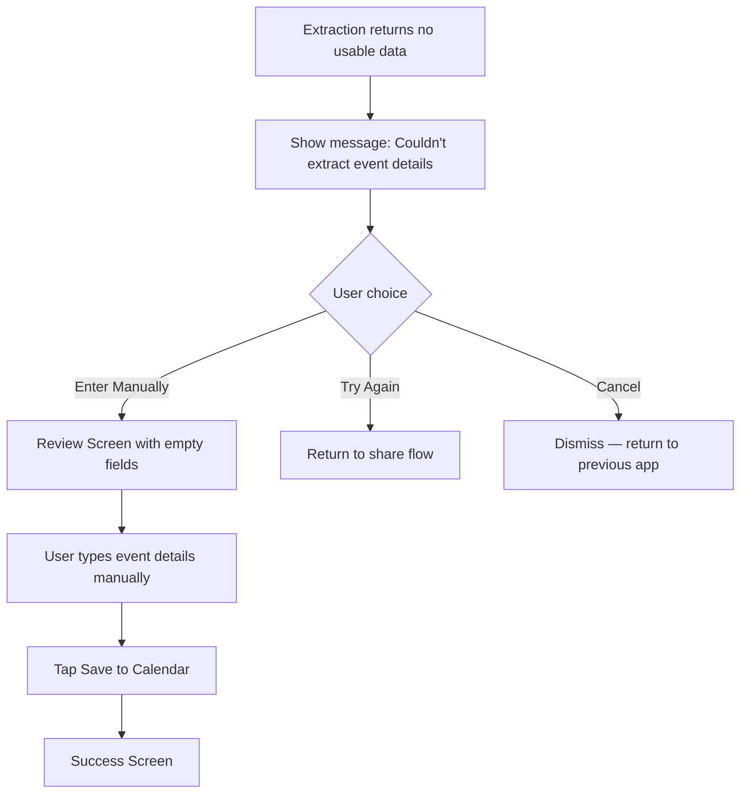

# UX Design Specification PostCal

**Author:** Ava
**Date:** 2026-03-27

---

## Executive Summary

### Project Vision

PostCal is a single-purpose mobile app that turns Instagram event posts into calendar entries through a share sheet integration. The app prioritizes speed and accuracy — the entire flow from share to save should take under 10 seconds. Everything runs on-device with no backend, no accounts, and no API costs.

The MVP consists of three screens: a Home instruction screen (opened directly), a Review/Edit event form (triggered via share sheet), and a Success confirmation screen. The app has no dashboard, no event history, and no navigation complexity — it does one thing and does it fast.

### Target Users

Primary user is a socially active person who follows music venues and club event accounts on Instagram, discovering events multiple times a week. They currently screenshot posts and manually enter event details into their calendar — a tedious process they frequently abandon. They want a zero-friction bridge from Instagram discovery to calendar commitment.

### Key Design Challenges

- **Share sheet entry point:** The primary interaction starts outside the app. The transition from Instagram → PostCal must feel seamless and instant, not like launching a separate app.
- **OCR confidence communication:** Extracted fields may have varying accuracy. The UI needs to clearly invite review/correction without making the user distrust the results or feel like they're doing data entry.
- **Minimal screen count:** With only three screens, every element must earn its place. No room for filler — the design must feel complete and polished with very little surface area.

### Design Opportunities

- **The Digital Concierge aesthetic:** The Manrope + Inter dual-typeface system with Calendar Blue (`#005bbf`) and tonal surface layering creates a premium, "smart planner" feel — editorial authority from Manrope headlines paired with Inter's functional clarity.
- **Speed as a UX feature:** If extraction is fast enough, the review screen can feel like a confirmation rather than a correction step — reinforcing trust and delight.
- **Contextual reference:** Showing the original IG post image alongside extracted fields (as in the existing mockup) lets users verify at a glance without switching apps.

## Core User Experience

### Defining Experience

The core experience is a three-beat rhythm: **share → confirm → done.** The user shares an Instagram post to PostCal, sees pre-populated event details already filled in, confirms with a single tap, and the event is in their calendar. The entire interaction should feel like a confirmation, not a data entry task.

The extraction happens instantly — no loading spinners, no "scanning..." progress bars, no waiting state. By the time the app screen appears, the fields are populated. Speed is the experience.

### Platform Strategy

- **React Native / Expo** mobile app targeting iOS and Android
- **Primary entry point:** System share sheet from Instagram — launches PostCal as a full app screen (not a lightweight sheet or overlay)
- **Secondary entry point:** Direct app launch shows instructional Home screen explaining the share sheet workflow
- **Fully on-device processing:** No network dependency, works offline, no account required
- **Native calendar integration:** Exports directly to the device's default calendar
- **Touch-first design:** All interactions optimized for one-handed mobile use with generous tap targets (44x44px minimum)

### Effortless Interactions

- **Extraction is invisible:** The user never sees OCR happening. Share sheet text/metadata is parsed first, OCR fills gaps — but from the user's perspective, the fields just appear populated.
- **One-tap save:** The primary CTA ("Save to Calendar") is the dominant action. No multi-step confirmation, no calendar picker, no "are you sure?" dialogs.
- **Smart defaults:** If a field can't be extracted, it's left empty and clearly editable — but the user is never forced to fill anything before saving.
- **No onboarding flow:** The Home screen is self-explanatory. No tutorial, no walkthrough, no sign-up. Open the app, read how it works, done.

### Critical Success Moments

1. **The "it just works" moment:** User shares from IG, PostCal opens with fields already filled. This is the make-or-break interaction — if it feels slow or empty, trust is lost immediately.
2. **The confident save:** User glances at the pre-populated fields, taps "Save to Calendar," and it's done. The flow should feel so fast that the user thinks "wait, that's it?"
3. **The calendar payoff:** Later, when the user opens their calendar and sees the event there — correctly named, correctly dated — PostCal has delivered on its promise.

### Experience Principles

1. **Invisible technology:** OCR, text parsing, and heuristics are implementation details the user never sees. The experience is "I shared a post and the event appeared."
2. **Confirmation over correction:** The review screen is a confidence check, not a form. Pre-populated fields signal "we got this" — editing is available but not expected.
3. **Respect the user's time:** Every screen, every element, every interaction must justify its existence. No filler, no upsells, no "rate this app" prompts. Get in, save the event, get out.
4. **Premium minimalism:** Three screens, one purpose, zero clutter. The Digital Concierge aesthetic makes a utility feel considered and intentional.

## Desired Emotional Response

### Primary Emotional Goals

The dominant feeling is **effortlessness** — PostCal should feel like a reflex, not an app interaction. The user shouldn't feel like they're "using an app" at all. Share, glance, tap, done. The cognitive load should be near zero.

### Emotional Journey Mapping

| Stage | Feeling | Design Implication |
|-------|---------|-------------------|
| **Share from IG** | Seamless, no friction | Instant transition — no splash screen, no loading |
| **See populated fields** | Pleasantly surprised | Fields appear already filled, reinforcing "it just works" |
| **Glance and confirm** | Confident, in control | Clean layout, clear data, obvious CTA |
| **Tap save** | Satisfied, efficient | Immediate response, brief success confirmation |
| **Back to Instagram** | Unbothered, flow unbroken | The interruption was so brief it barely registered |

### Micro-Emotions

- **Confidence over skepticism:** Pre-populated fields should look correct and trustworthy at a glance. No "are you sure?" friction.
- **Efficiency over accomplishment:** This isn't a task to celebrate — it's a task to barely notice. The success screen should confirm, not congratulate.
- **Calm over excitement:** The UI should feel quiet and composed. No animations competing for attention, no confetti, no gamification.

### Design Implications

- **No loading states:** Extraction must complete before the screen renders. If the user sees a spinner, the illusion of effortlessness breaks.
- **Minimal success screen:** A brief, understated confirmation — not a celebration. The user wants to get back to scrolling, not admire a checkmark animation.
- **Quiet confidence in typography:** Manrope headlines signal authority ("we extracted this correctly"), Inter body text keeps things functional and readable.
- **Tonal surfaces over borders:** The Digital Concierge layering approach creates calm visual hierarchy without harsh divisions that demand attention.

### Emotional Design Principles

1. **Invisible effort:** The best interaction is one the user doesn't remember having. PostCal should disappear into the workflow.
2. **Quiet competence:** The app communicates reliability through clean presentation, not through reassurance text or progress indicators.
3. **Proportional response:** A 5-second interaction gets a 1-second confirmation. Don't over-celebrate a micro-task.

## UX Pattern Analysis & Inspiration

### Inspiring Products Analysis

**iOS Share Sheet Extensions (Safari "Add to Reading List", Save to Pocket)**
- The gold standard for share-sheet-triggered actions: tap share, select target, done
- No intermediate screens when possible — the action completes in the background
- Lesson: the share sheet itself is the UI. Minimize what happens after the tap.

**Apple Shortcuts / Quick Actions**
- Single-purpose automations that feel like OS-level features, not apps
- No onboarding, no accounts, no settings to configure first
- Lesson: the best utility feels like it was always part of the system

**Shazam**
- Instant recognition with minimal UI — tap, identify, done
- Results appear populated and confident, not tentative
- The "magic" is in the speed: the answer appears before you expect it
- Lesson: when technology works fast enough, it feels like magic, not processing

### Transferable UX Patterns

**Instant Capture Pattern (from Shazam, share sheet tools)**
- Trigger → result → confirm, with no intermediate states
- The user's intent is clear from the trigger — don't re-ask what they want
- Apply to PostCal: share triggers extraction, result appears ready to save

**Confident Defaults Pattern (from iOS Quick Actions)**
- Present results as facts, not suggestions
- Editable but not tentative — fields look filled, not "pending review"
- Apply to PostCal: pre-populated fields use standard input styling, not a "suggestion" treatment

**Glanceable Verification Pattern (from payment confirmations)**
- Key information scannable in under 2 seconds: name, date, time, place
- Visual hierarchy guides the eye top-to-bottom in reading order
- Apply to PostCal: event fields ordered by importance, CTA at the bottom

### Anti-Patterns to Avoid

- **The "processing theater" trap:** Showing fake progress bars or step-by-step animations to seem thorough. PostCal should never show "Scanning image... Extracting text... Parsing dates..." — just show the result.
- **Over-confirmation:** "Are you sure?" dialogs, double-tap to confirm, "Event saved! Would you like to..." — every extra tap breaks the effortless feeling.
- **Feature creep disguised as helpfulness:** "Smart suggestions," conflict detection, calendar picker, reminder options — none of this belongs in MVP. The existing mockup's "Smart Suggestion" card about calendar conflicts is an anti-pattern for v1.
- **Celebration inflation:** Giant checkmarks, confetti, "Great job!" messaging for a 5-second task. The success confirmation should be proportional to the effort.

### Design Inspiration Strategy

**Adopt:**
- Share sheet → instant result → one-tap confirm flow (from iOS share extensions)
- Confident, pre-populated fields that look like facts (from payment/booking confirmations)
- Minimal success confirmation proportional to task size

**Adapt:**
- Shazam's "instant magic" feel, but with an editable review step since OCR isn't perfect
- The existing review_edit_event mockup's layout (IG preview + form), simplified to remove the Smart Suggestion card and bottom nav for MVP

**Avoid:**
- Processing theater or loading animations
- Over-confirmation dialogs
- Feature suggestions or smart insights in MVP
- Celebration-heavy success screens

## Design System Foundation

### Design System Choice

**Base:** react-native-ui-lib (RNUILib) by Wix — a production-grade React Native component library with comprehensive theming, gesture support, and performance optimization.

**Theme:** The Digital Concierge — custom theme applied on top of RNUILib's theming system to achieve the editorial, premium utility aesthetic.

### Rationale for Selection

- **RNUILib's theming engine** supports full token-based customization (colors, typography, spacing, border radius) — maps directly to the Digital Concierge spec
- **Production-proven** at Wix scale — stable, well-maintained, actively developed
- **Rich component set** includes form inputs, buttons, cards, and overlays needed for PostCal's three screens
- **Expo compatible** — works with Expo managed workflow and EAS builds
- **Solo developer friendly** — comprehensive defaults reduce decision fatigue while allowing full customization

### Implementation Approach

**RNUILib Theme Configuration (Digital Concierge tokens):**

| Token | Value | Usage |
|-------|-------|-------|
| `primary` | `#005bbf` | Calendar Blue — CTAs, active states, accents |
| `primaryContainer` | `#1a73e8` | Gradient endpoint for primary CTAs |
| `surface` | `#f8f9fa` | Base background |
| `surfaceContainerLow` | `#f3f4f5` | Input field fills, de-emphasized regions |
| `surfaceContainerLowest` | `#ffffff` | Card backgrounds, active input fills |
| `surfaceContainerHigh` | `#e7e8e9` | Secondary button fills, elevated states |
| `onSurface` | `#191c1d` | Primary text (never pure black) |
| `onSurfaceVariant` | `#414754` | Secondary text, labels |
| `tertiary` | `#9e4300` | Accent for non-blue highlights |
| `tertiaryContainer` | `#c55500` | Contextual insight cards |
| `outlineVariant` | `#c1c6d6` | Ghost borders at 15% opacity only |

**Typography (loaded via expo-font):**
- **Headlines:** Manrope Bold/ExtraBold — editorial authority
- **Body & Labels:** Inter Regular/Medium/Semibold — functional clarity
- Touch targets: minimum 44x44px per accessibility requirements

**Component Rules (from Digital Concierge spec):**
- No 1px solid borders — boundaries defined by surface color shifts only
- Primary CTAs use gradient fill (`primary` → `primaryContainer` at 135°)
- Secondary buttons use `surfaceContainerHigh` fill with `onSurface` text
- Input fields use `surfaceContainerLow` fill, shift to `surfaceContainerLowest` on focus with 2px ghost border at `primary` 40% opacity
- Cards use `surfaceContainerLowest` on `surfaceContainerLow` backgrounds for tonal lift
- Corner radius: `rounded-lg` (0.5rem) for buttons, `rounded-xl` (0.75rem) for cards
- Shadows: tinted `onSurface` at 6% opacity, 24px blur — never pure black

### Customization Strategy

- **Theme-first approach:** Configure RNUILib's `ThemeManager` with Digital Concierge tokens at app initialization — all components inherit the theme automatically
- **Minimal custom components:** RNUILib's `TextField`, `Button`, `Card`, and `View` cover PostCal's three screens. Custom styling via theme presets rather than wrapper components
- **No-line enforcement:** Override any RNUILib defaults that use borders — replace with tonal surface shifts per the Digital Concierge "No-Line Rule"
- **Glassmorphism utility:** Create a single reusable style for floating elements (backdrop blur 20px, `surfaceContainerLowest` at 80% opacity) — used sparingly on success toast

## Defining Experience

### Defining Interaction

**"Share an IG post, see the event already extracted, tap save."**

This is PostCal described to a friend. The defining interaction is the moment the review screen appears with fields already populated — the user didn't type anything, didn't wait for anything, and the event is ready to save. The magic is in the absence of effort.

### User Mental Model

The user's mental model is simple: "I'm telling my phone to remember this event for me." They don't think about OCR, text parsing, or extraction pipelines. They think: share → it's in my calendar.

**Current workaround:** Screenshot → open calendar app → manually type event name, date, time, venue → save. This takes 30-60 seconds and is frequently abandoned.

**PostCal replacement:** Share → glance → tap. Under 10 seconds. The mental model shifts from "data entry" to "confirmation."

### Success Criteria

- Fields appear pre-populated before the user has time to think "is it loading?"
- The user's eyes scan top-to-bottom (name → date → time → venue) and land on "Save to Calendar" within 2 seconds
- Missing fields are simply empty — no alerts, no indicators, no friction. The event saves with whatever was extracted.
- After tapping save, the user is back in their flow within 1 second

### Novel UX Patterns

PostCal uses **entirely established patterns** combined in a focused way:

- **Share sheet as entry point** — standard OS pattern, zero learning curve
- **Pre-populated form** — familiar from booking confirmations, autofill, contact cards
- **Single primary CTA** — standard mobile conversion pattern

**No novel patterns needed.** The innovation is in the *reduction* — removing everything that other apps add. No onboarding wizard, no account creation, no settings, no tutorial. The UX novelty is how little there is.

### Experience Mechanics

**1. Initiation:**
- User taps Share in Instagram → selects PostCal from share sheet
- PostCal receives shared content (text, metadata, image URI)
- Extraction runs: share sheet text/metadata parsed first, OCR on image second, results merged

**2. Presentation:**
- Review screen renders with fields already populated
- No loading state, no transition animation — the screen appears ready
- Layout: IG post preview at top → event fields below → "Save to Calendar" CTA at bottom
- Empty fields are just empty — no placeholder text, no "tap to add" prompts

**3. Interaction:**
- User scans fields top-to-bottom
- Any field is tappable to edit (standard text input behavior)
- No required fields — user can save with partial data
- No validation errors — whatever the user confirms is what gets saved

**4. Completion:**
- User taps "Save to Calendar" → event written to device calendar
- Brief success confirmation displayed
- User navigates back or app closes — flow complete

## Visual Design Foundation

### Color System

The Digital Concierge palette anchored by Calendar Blue, applied through RNUILib's ThemeManager:

**Primary Palette:**
- `primary` (#005bbf) — Calendar Blue, CTAs, active states, links
- `primaryContainer` (#1a73e8) — Gradient endpoint, 135° angle with primary
- `primaryFixedDim` (#adc7ff) — Disabled states, maintains brand harmony

**Surface Hierarchy (No-Line Rule):**
- `surface` (#f8f9fa) — Base layer, screen backgrounds
- `surfaceContainerLow` (#f3f4f5) — Subtle grouping, input fills
- `surfaceContainerLowest` (#ffffff) — Cards, active inputs, elevated content
- `surfaceContainerHigh` (#e7e8e9) — Secondary buttons, elevated states
- `surfaceContainerHighest` (#e1e3e4) — Contextual sheet handles

**Text & Semantic:**
- `onSurface` (#191c1d) — Primary text, never pure black
- `onSurfaceVariant` (#414754) — Labels, metadata, secondary text
- `tertiary` (#9e4300) — Non-blue accent (future use)
- `error` (#ba1a1a) — Error states only (not used in MVP confirmation flow)

**Depth without borders:** All spatial separation achieved through surface color tiers. No 1px borders anywhere. Ghost borders (`outlineVariant` #c1c6d6 at 15% opacity) only for accessibility fallback in high-contrast modes.

### Typography System

**Dual-typeface system loaded via expo-font:**

| Role | Typeface | Weight | Size | Usage |
|------|----------|--------|------|-------|
| Display | Manrope | ExtraBold (800) | 2.25rem (36px) | Home screen title |
| Headline | Manrope | Bold (700) | 1.5rem (24px) | Screen titles, "Confirm Event Details" |
| Title | Manrope | Bold (700) | 1.125rem (18px) | Section headers, event name display |
| Body | Inter | Medium (500) | 0.875rem (14px) | Input field values, body text |
| Label | Inter | Semibold (600) | 0.75rem (12px) | Field labels, metadata |
| Caption | Inter | Regular (400) | 0.6875rem (11px) | Timestamps, hints |

**Type Rules:**
- Headlines use tight letter-spacing (-0.02em) for editorial impact
- Body text uses standard tracking (0.01em) for legibility
- Always pair `headline` with `body` that has at least 1.5x the headline's leading ("The Curator's Breath")
- Labels sit above fields, never inside as placeholder text

### Spacing & Layout Foundation

**Base Unit:** 4px grid system

**Spacing Scale:**

| Token | Value | Usage |
|-------|-------|-------|
| `xs` | 4px | Tight internal padding |
| `sm` | 8px | Icon-to-text gaps |
| `md` | 16px | Between form fields, standard gaps |
| `lg` | 24px | Section spacing, screen horizontal padding |
| `xl` | 32px | Between major sections |
| `2xl` | 48px | Hero breathing room, top margins |
| `3xl` | 64px | Editorial whitespace between screen regions |

**Layout Principles:**
- **Spacious over compact:** Generous padding and vertical breathing room between fields. The review screen should feel unhurried — not cramped.
- **Asymmetric margins:** Per the Digital Concierge spec, headers use a larger top margin (2xl/48px) paired with a smaller bottom margin (lg/24px) for editorial flow
- **Screen horizontal padding:** 24px (lg) on both sides — standard mobile safe area
- **No scrolling on review screen:** Despite spacious layout, all fields and the CTA should be visible without scrolling on standard screen sizes (375pt width, 667pt+ height)
- **Touch targets:** Minimum 44x44px for all interactive elements, even if the visual element is smaller

### Accessibility Considerations

- **Contrast ratios:** `onSurface` (#191c1d) on `surface` (#f8f9fa) exceeds WCAG AAA (>7:1). `onSurfaceVariant` (#414754) on `surface` meets AA (>4.5:1).
- **No color-only indicators:** Empty fields are simply empty — no color-coded status that would be invisible to colorblind users
- **Font sizes:** Minimum 11px (caption), standard body 14px — well above minimum accessibility thresholds
- **Touch targets:** 44x44px minimum per Apple HIG and Material guidelines
- **Ghost borders at 15% opacity** available as accessibility fallback in high-contrast mode
- **No pure black (#000000):** Using `onSurface` (#191c1d) prevents OLED "visual vibration"

## Design Direction Decision

### Design Directions Explored

Two design directions were explored through existing mockups in `design/stitch/`:

1. **The Kinetic Curator** (`rnulib_modern/`) — Purple primary (#3e24e7), Inter-only typography, vibrant editorial aesthetic
2. **The Digital Concierge** (`kinetic_utility/`) — Calendar Blue primary (#005bbf), Manrope + Inter dual-typeface, premium utility aesthetic

Both directions were prototyped across Home Dashboard, Review/Edit Event, and Export Success screens.

### Chosen Direction

**The Digital Concierge** — selected for its calm, professional tone that matches PostCal's utility-first identity. Calendar Blue feels purposeful and trustworthy. The Manrope + Inter pairing creates clear hierarchy without competing for attention.

**Reference mockups (to be adapted for MVP):**
- `design/stitch/home_dashboard/screen.png` — Home screen baseline
- `design/stitch/review_edit_event/screen.png` — Review/Edit event baseline
- `design/stitch/export_success/screen.png` — Success confirmation baseline

### Design Rationale

- **Calendar Blue over purple:** PostCal is a calendar utility. Blue signals trust, productivity, and calm — aligned with the "quiet competence" emotional principle. Purple felt more expressive than the interaction warrants.
- **Dual-typeface system:** Manrope headlines create editorial authority for screen titles. Inter body text maintains functional clarity for form fields and data. The contrast between the two creates natural hierarchy.
- **Existing mockups prove the direction:** The review_edit_event screen already demonstrates the core interaction — IG preview at top, editable fields below, gradient CTA at bottom. This layout works.

### MVP Adaptations from Existing Mockups

The existing mockups include features beyond MVP scope. The following elements are **removed** for v1:

**Home Screen — Simplify to instruction-only:**
- Remove: "Recently Imported" event list
- Remove: "Sync New Post" FAB
- Remove: Bottom navigation bar (Home / Recent / Settings)
- Remove: Notifications bell icon
- Keep: App header with PostCal branding
- Keep: "How it Works" three-step instruction cards (Share → Confirm → Save)
- Adapt: Instructions should reference Instagram specifically, not generic "post or story link"

**Review/Edit Event Screen — Simplify to confirmation flow:**
- Remove: "Smart Suggestion" conflict detection card
- Remove: Bottom navigation bar
- Remove: "View on Instagram" link (not needed for confirmation)
- Keep: IG post image preview at top as reference context
- Keep: Event Name, Date, Time, Location fields
- Keep: "Save to Calendar" gradient CTA
- Keep: "Cancel" secondary button
- Adapt: No "more options" menu icon — nothing to configure

**Success Screen — Simplify to brief confirmation:**
- Remove: "Open Calendar" CTA (user should return to IG, not go to calendar)
- Remove: Bottom navigation bar
- Remove: "Reminder set 15m before" detail
- Keep: Success checkmark icon (understated, not celebratory)
- Keep: Event name and time confirmation text
- Adapt: Single CTA — "Done" or auto-dismiss after brief delay
- Adapt: Reduce visual weight — smaller icon, less whitespace, proportional to the micro-task

### Implementation Approach

- **RNUILib components** themed with Digital Concierge tokens handle all three screens
- **No custom component library needed** — `TextField`, `Button`, `Card`, `View`, and `Image` cover the full MVP
- **Screen-by-screen build order:** Review/Edit first (core interaction), Success second, Home last (lowest priority)

## User Journey Flows

### Journey 1: Share Sheet Event Capture (Primary Flow)

The core journey — user sees an event on Instagram and saves it to their calendar.

**Flow Details:**

| Step | Duration | User Action | System Response |
|------|----------|-------------|-----------------|
| Share | ~1s | Tap share, select PostCal | Receive shared content |
| Extract | <1s | None (invisible) | Parse metadata + OCR, merge results |
| Review | 2-3s | Glance at fields, tap Save | Display pre-populated form |
| Confirm | <1s | None | Write to calendar, show success |
| **Total** | **< 10s** | **3 taps max** | |

### Journey 2: Direct App Launch (Secondary Flow)

User opens PostCal directly — sees instructions on how to use the share sheet.

**Flow Details:**

This is a dead-simple informational screen. No interaction required beyond reading. The user learns the workflow and leaves. The Home screen's only job is to answer "how do I use this?" — then get out of the way.

### Journey 3: Extraction Failure Recovery

When OCR can't extract usable event details from the shared content.

**Design Notes:**
- The error message should be brief and neutral — not apologetic or alarming
- "Enter Manually" is the primary action (user still wants to save the event)
- "Try Again" is secondary (might work with a different image of the same event)
- This flow should feel like a minor detour, not a dead end

### Journey Patterns

**Entry Pattern:** All journeys start from one of two entry points — share sheet (primary) or app icon (secondary). No deep linking, no push notifications, no other entry points in MVP.

**Linear Progression:** Every journey is a straight line with minimal branching. No loops, no multi-step wizards, no "back to step 2" flows. Forward momentum only.

**Graceful Degradation:** When extraction fails, the app degrades to a manual entry tool rather than blocking the user. The event can still be saved — just with more typing.

**Single Exit:** Every journey ends with either "event saved" or "cancelled." No "save and share," no "save and create another," no "would you also like to..." branching.

### Flow Optimization Principles

1. **Minimize taps:** The happy path is 3 taps: Share → PostCal → Save to Calendar. Every additional tap must be justified.
2. **No dead ends:** Every state has a clear path forward. Extraction failure leads to manual entry, not an error screen with only a "dismiss" button.
3. **No back navigation needed:** The flow is short enough that "back" is unnecessary. Cancel exits entirely. There's no step 2 to go back to from step 3.
4. **System does the work:** The user's only job is to confirm. Extraction, parsing, calendar writing — all invisible. The user sees input and output, never process.

## Component Strategy

### Design System Components

**RNUILib components used directly (themed with Digital Concierge tokens):**

| Component | RNUILib Component | Screen | Usage |
|-----------|------------------|--------|-------|
| Event Name Input | `TextField` | Review | Pre-populated event name, editable |
| Date Input | `TextField` | Review | Pre-populated date, editable |
| Time Input | `TextField` | Review | Pre-populated time, editable |
| Location Input | `TextField` | Review | Pre-populated venue, editable |
| Save to Calendar | `Button` | Review | Primary CTA, gradient fill |
| Cancel | `Button` | Review | Secondary CTA, surface fill |
| Done | `Button` | Success | Primary CTA to dismiss |
| Enter Manually | `Button` | Error | Primary CTA for fallback |
| Try Again | `Button` | Error | Secondary CTA |
| Screen Container | `View` | All | Surface background, safe area padding |
| Section Container | `View` | Home | Instruction card grouping |
| Card | `Card` | Home | "How it Works" step cards |
| Text | `Text` | All | Headlines (Manrope), body (Inter) |

**Coverage: 100% of MVP needs met by RNUILib primitives.** No third-party component additions required.

### Custom Components

Only one custom element is needed — everything else is standard RNUILib with theme overrides:

**Extracted Text Preview (Review Screen)**

- **Purpose:** Display the raw extracted text from the shared IG post as reference context so the user can verify extracted fields against the source
- **Content:** Plain text block showing the caption/OCR text that was parsed
- **Implementation:** `View` with `surfaceContainerLow` background + `Text` in `onSurfaceVariant` color, `label` size
- **States:** Static only — not interactive, not editable
- **Placement:** Top of Review screen, above the form fields
- **Design:** Subtle, de-emphasized — this is reference material, not the primary content. Should be glanceable but not dominant.

### Component Implementation Strategy

**Theme-first, not component-first:**

1. Configure `ThemeManager` with all Digital Concierge tokens (colors, typography, spacing, border radius) at app initialization
2. Use RNUILib components with theme presets — no wrapper components, no custom component library
3. Apply Digital Concierge rules via style overrides where RNUILib defaults conflict:
   - Remove all default borders (No-Line Rule)
   - Override `TextField` default styling: `surfaceContainerLow` fill, no border, `surfaceContainerLowest` on focus with ghost border
   - Override `Button` primary preset: gradient fill instead of flat
   - Override `Card` default: no shadow, tonal lift only

**Gradient CTA Implementation:**
- React Native `LinearGradient` (from `expo-linear-gradient`) wrapped around `Button` for the primary "Save to Calendar" CTA
- Gradient: `primary` (#005bbf) → `primaryContainer` (#1a73e8) at 135°
- This is the only component requiring a non-RNUILib dependency

### Implementation Roadmap

**All components ship in a single MVP release — no phasing needed.**

Build order optimized for testing the core interaction first:

1. **Theme setup** — Configure RNUILib ThemeManager with Digital Concierge tokens
2. **Review Screen** — TextField x4, gradient Button, Cancel Button, Extracted Text Preview
3. **Success Screen** — Checkmark icon, confirmation Text, Done Button
4. **Error Screen** — Message Text, Enter Manually Button, Try Again Button
5. **Home Screen** — Header, three instruction Cards, body Text

## UX Consistency Patterns

### Button Hierarchy

**Two tiers only — no tertiary buttons in MVP:**

| Tier | Style | Usage | Example |
|------|-------|-------|---------|
| Primary | Gradient fill (`primary` → `primaryContainer` at 135°), white text, Manrope Bold | The one action the user should take | "Save to Calendar", "Enter Manually", "Done" |
| Secondary | `surfaceContainerHigh` fill, `onSurface` text, Manrope Bold | Alternative or escape action | "Cancel", "Try Again" |

**Button Rules:**
- Only one primary button per screen
- Primary always appears above secondary in vertical stack
- Full-width buttons on all screens (no inline button pairs)
- Minimum height: 48px (exceeds 44px touch target)
- Corner radius: `rounded-lg` (0.5rem)
- No disabled states in MVP — buttons are always tappable

### Feedback Patterns

**Success Feedback:**
- Success screen auto-dismisses after 2 seconds — no user action required
- Brief confirmation: checkmark icon + event name + "Saved to Calendar"
- Understated visual treatment — proportional to the micro-task
- If auto-dismiss fails or user taps screen, dismiss immediately

**Error Feedback:**
- Single error state: "Couldn't extract event details"
- Neutral tone — no apology, no alarm, no exclamation marks
- Always offers a path forward: "Enter Manually" (primary) + "Try Again" (secondary) + implicit cancel (back gesture)
- No inline field-level errors — fields accept any input, no validation

**No other feedback types in MVP:**
- No warnings, info banners, toasts, or snackbars
- No "saving..." or "processing..." states
- No network error states (everything is on-device)

### Form Patterns

**Input Fields:**
- All fields use identical styling: `surfaceContainerLow` fill, no border, `rounded-xl` corners
- Focus state: background shifts to `surfaceContainerLowest`, 2px ghost border in `primary` at 40% opacity
- Labels always above the field in `label` size (Inter Semibold, 12px, `onSurfaceVariant`)
- No placeholder text inside fields — either populated with extracted data or empty
- No required field indicators — all fields are optional
- No character limits, no input masks, no format validation

**Field Order (Review Screen):**
1. Event Name
2. Date
3. Time
4. Location

This matches natural reading order and the order of importance for calendar events.

**Keyboard Behavior:**
- Tapping a field opens the appropriate keyboard
- "Next" key advances to the next field
- "Done" key dismisses the keyboard
- Tapping outside any field dismisses the keyboard

### Navigation Patterns

**No persistent navigation in MVP.** No tab bar, no hamburger menu, no drawer.

**Screen transitions:**
- Share sheet → Review Screen: standard OS push transition
- Review Screen → Success Screen: replace (no back navigation to review after saving)
- Success Screen → auto-dismiss: fade out after 2 seconds
- Cancel on Review: dismiss/pop back to previous app

**Back gesture:** System back gesture (swipe from edge on iOS, back button on Android) acts as Cancel on the Review screen — dismisses without saving.

### Additional Patterns

**Empty Fields:**
- Fields that extraction couldn't populate are simply empty — no placeholder text, no "tap to add" hint, no visual differentiation from populated fields
- The user can save with empty fields — the calendar event will have missing information, which is acceptable

**Extracted Text Preview:**
- Appears at the top of the Review screen as a reference block
- `surfaceContainerLow` background, `onSurfaceVariant` text, `label` size
- Static, non-interactive — purely for visual reference
- If no text was extracted (image-only share), this block is hidden entirely

**Screen Headers:**
- Review Screen: "Confirm Event Details" in `headline` (Manrope Bold, 24px)
- Success Screen: "Saved to Calendar" in `headline`
- Home Screen: "PostCal" in `display` (Manrope ExtraBold, 36px)
- Error Screen: "Couldn't extract event details" in `title` (Manrope Bold, 18px)

## Responsive Design & Accessibility

### Responsive Strategy

**Mobile-only, dual-platform:** PostCal targets iOS and Android phones. No tablet optimization, no desktop, no web.

**Screen Size Adaptation:**

| Category | Width Range | Approach |
|----------|-----------|----------|
| Small phones | 320-374pt | Reduce spacing scale by one tier (lg→md, xl→lg). All content must remain visible without scrolling on Review screen. |
| Standard phones | 375-413pt | Default layout — designed at this size. Reference: iPhone 14/15, Pixel 7. |
| Large phones | 414pt+ | Maintain standard layout with additional breathing room. Do not expand to fill — keep max content width. |

**No breakpoints needed.** PostCal uses flexible layouts with percentage-based widths and the spacing scale — not fixed breakpoints. RNUILib's layout primitives handle this natively.

**Platform-Specific Considerations:**

| Concern | iOS | Android |
|---------|-----|---------|
| Safe area | `SafeAreaView` for notch/Dynamic Island | Status bar + navigation bar insets |
| Back navigation | Swipe from left edge = Cancel | System back button = Cancel |
| Share sheet entry | iOS Share Extension | Android Intent Filter |
| Keyboard handling | iOS keyboard avoidance | Android `windowSoftInputMode` |
| Font rendering | SF Pro fallback if custom fonts fail | Roboto fallback |
| Success auto-dismiss | Standard animated transition | Respect system animation scale setting |

### Accessibility Strategy

**Target: WCAG 2.1 Level AA** — industry standard, appropriate for a utility app.

**Already covered by design decisions:**
- Color contrast: `onSurface` on `surface` exceeds AAA (>7:1), `onSurfaceVariant` on `surface` meets AA (>4.5:1)
- Touch targets: 48px button height exceeds 44px minimum
- No color-only information: empty fields are just empty, no color coding
- No pure black text: `onSurface` (#191c1d) prevents OLED vibration
- Labels above fields, never inside as placeholders

**Additional accessibility requirements:**

- **Screen reader support:** All interactive elements must have `accessibilityLabel` props. Field labels must be programmatically associated with their inputs.
- **VoiceOver/TalkBack flow:** Reading order matches visual order — extracted text preview → event name → date → time → location → save → cancel
- **Reduced motion:** Respect `prefers-reduced-motion` / `AccessibilityInfo.isReduceMotionEnabled`. If enabled, success screen dismisses instantly instead of fade animation.
- **Dynamic type (iOS) / Font scaling (Android):** Support system font size preferences up to 1.5x. Layout must accommodate larger text without breaking.
- **High contrast mode:** Ghost borders become visible (15% → 100% opacity) when system high contrast is enabled.

### Testing Strategy

**Device Testing:**
- iOS: Test on iPhone SE (small), iPhone 15 (standard), iPhone 15 Pro Max (large)
- Android: Test on Pixel 7 (standard), Samsung Galaxy S24 (large), older/smaller devices via emulator
- Test with system font size set to maximum

**Accessibility Testing:**
- VoiceOver (iOS): Navigate full share → review → save flow eyes-closed
- TalkBack (Android): Same flow verification
- Verify all fields are announced with labels
- Verify button actions are clearly described
- Test with Reduce Motion enabled

**Platform Testing:**
- Verify share sheet integration works from Instagram on both platforms
- Verify calendar write permission flow on both platforms
- Verify keyboard avoidance doesn't obscure fields on smallest screen size

### Implementation Guidelines

**React Native Accessibility Props:**
- Every `Button`: `accessibilityLabel`, `accessibilityRole="button"`
- Every `TextField`: `accessibilityLabel` matching visible label text
- Extracted text preview: `accessibilityRole="text"`, descriptive label
- Success screen: `accessibilityLiveRegion="polite"` to announce confirmation
- Screen containers: `accessibilityRole="header"` on screen titles

**Layout Implementation:**
- Use `flex` layouts exclusively — no absolute positioning except for overlays
- Use `SafeAreaView` from `react-native-safe-area-context` on all screens
- Use spacing tokens from the scale — never hardcoded pixel values
- Test keyboard avoidance with `KeyboardAvoidingView` wrapping the Review screen form
